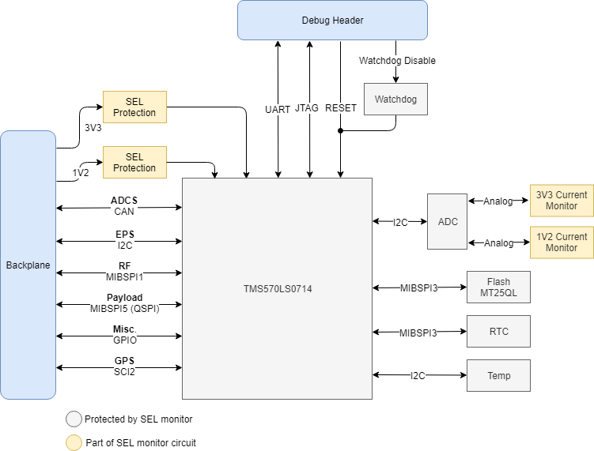

# OBC Firmware

## Overview
This repository contains firmware for the ORCASat on-board computer (OBC) system. The goal of the OBC is to provide automatic on-board satellite operation, along with command-driven operation when requested by ground. In the process, the OBC collects telemetry for health assessment of the satellite and handles any detected on-orbit errors. The OBC must be a reliable, self-sustaining system to enable the payload to focus on mission execution, and enable other sub-systems to support the payload. The two payloads that this OBC has been designed to support are:

* Known radio-frequency source for calibration of the CHIME experiment
* Known light source allowing photometric telescopes to calibrate for atmospheric interference

## Software Components
* **FreeRTOS V10:** real-time OS commonly used in embedded systems. Helps with prioritizing different OBC functions and suspending tasks where no longer needed.
* **Command System:** linked to UART peripheral for testing and radio for in-flight communciation
* **LittleFS:** filesystem developed by [ARM Mbed](https://github.com/ARMmbed/littlefs) for use in NOR flash embedded systems. *SPIFFS code to be replaced with LittleFS code in the near future!*

## Hardware Components
* **TI Hercules TMS570LS1224:** main microcontroller for the OBC. Chosen for its flight heritage, strong performance under radiation, error-correcting memory, and lockstep architecture.
* **NOR Flash:** non-volatile memory storage for the OBC, used for configuration settings and telemetry storage. NOR flash performs well under radiation, and was chosen for its higher capacity than similar-performing media.
* **Real-Time Clock:** used to timestamp satellite telemetry and provide a time reference for commands.
* **Watchdog:** checks if the main MCU is continously operating, and resets the MCU in case of software lock.
* **Temperature Sensor:** monitors OBC board temperature to ensure it is within operating limits.
* **Current Monitor(s):** monitors current draw of all components on the OBC board, and provides a trigger to the SEL protection circuit when this current draw spikes to unreasonable values.

## Documentation
### Technical Documentation
* [OBC Master Design Document](https://docs.google.com/document/d/1iUOOutVvKmXDuKhrhJllWsyyqI5qOOHv6s-C4nPfq8s/edit#): LINK TO BE UPDATED - detailed list of design requirements for all features of the OBC
* [Hardware Design Documents](https://drive.google.com/drive/u/1/folders/1jUVG_gGRDT_HQtwlOXOTLdOSVqdMvAYh): LINK TO BE UPDATED - series of documents outlining the selection of hardware components

### Educational Resources
* [Getting Started Guide](https://drive.google.com/file/d/1iuzcKaon3ULmhoL1geDVbrWXXo6Atj3J/view): on-boarding instructions for new members
* [Wiki Resource Guide](https://gitlab.com/alea-2020/command-data-handling/obc2-firmware/-/wikis/On-Boarding/Resource-Guide): list of useful resources for OBC development 
* [Wiki Coding Standards Guide](https://gitlab.com/alea-2020/command-data-handling/obc2-firmware/-/wikis/On-Boarding/Coding-Standards): tips and practices for being a firmware developer on the OBC team

### TMS570LS1224 Resources
* [Technical Reference Manual](https://drive.google.com/open?id=17doo1temd0LEwKbF2LO4jQYLNh7f8uYi): detailed documentation on all peripherals and their possible configurations
* [Datasheet](https://drive.google.com/open?id=1kN2rP7y_L3qxxUjBQxRxYyoKFHdrLKTn): useful electrical and pinout documentation
* [LaunchPad Manual](https://drive.google.com/open?id=14i5bz0B0l70jtOQ9fogAqojB1EsuRPHr): pin configurations for the Launchpad and instructions for developing with it 

### FreeRTOS Resources
* [FreeRTOS V10 Reference Manual](http://www.freertos.org/Documentation/FreeRTOS_Reference_Manual_V10.0.0.pdf)
* [FreeRTOS Tutorial Guide](https://www.freertos.org/Documentation/161204_Mastering_the_FreeRTOS_Real_Time_Kernel-A_Hands-On_Tutorial_Guide.pdf)
* [FreeRTOS Support Forum](http://www.freertos.org/FreeRTOS_Support_Forum_Archive/freertos_support_forum_archive_index.html)

